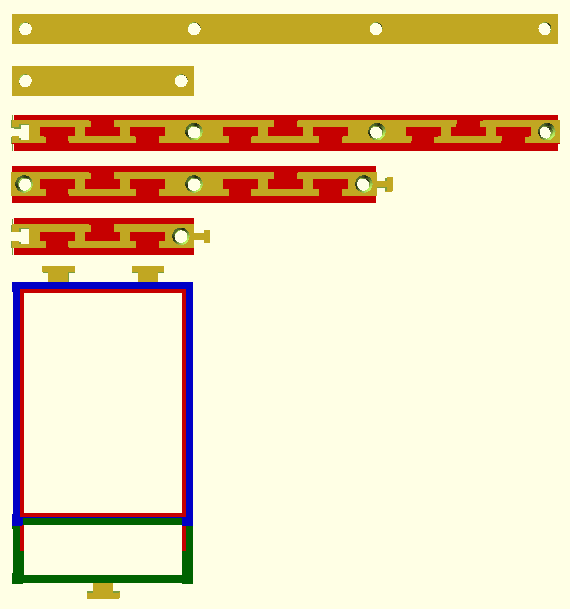

# OpenScad expandable pcb mount

A library for mounting pcb's.

## pcb_mount_cover()
creates a pcb cover.

* `pcb_x, pcb_y, pcb_z` = dimensions of the pcb
* `inner_support_width and height` = (#red) below the pcb 
* `outer_width and height` = (#blue) around the pcb
* `wire_addon` = (#green) add a cut of the pcb to organize wireing
* `connector` = (#yellow) for connecting the pcb cover to the rail

## pcb_mount_rail(pcb_count, conn_left, conn_right)
creates a rail for mounting pcb covers.

* `pcb_count` = count of pcb covers connectable to the rail
* `conn_left and right` = plug/jack to connect rails to each other

## pcb_mount_rail_lock(pcb_count, height)
creates a rail to lock pcb covers in place

* `pcb_count` = count of pcb covers to lock
* `height` = height of the lock

## TLDR
Using large circuit boards is a no go for me as I have limited electronic/soldering skills. I keep messing things up.

This library helps to organize, exchange circuit boards and grow a project later on.

Shield: [![CC BY-NC-SA 4.0][cc-by-nc-sa-shield]][cc-by-nc-sa]

This work is licensed under a
[Creative Commons Attribution-NonCommercial-ShareAlike 4.0 International License][cc-by-nc-sa].

[![CC BY-NC-SA 4.0][cc-by-nc-sa-image]][cc-by-nc-sa]

[cc-by-nc-sa]: http://creativecommons.org/licenses/by-nc-sa/4.0/
[cc-by-nc-sa-image]: https://licensebuttons.net/l/by-nc-sa/4.0/88x31.png
[cc-by-nc-sa-shield]: https://img.shields.io/badge/License-CC%20BY--NC--SA%204.0-lightgrey.svg

